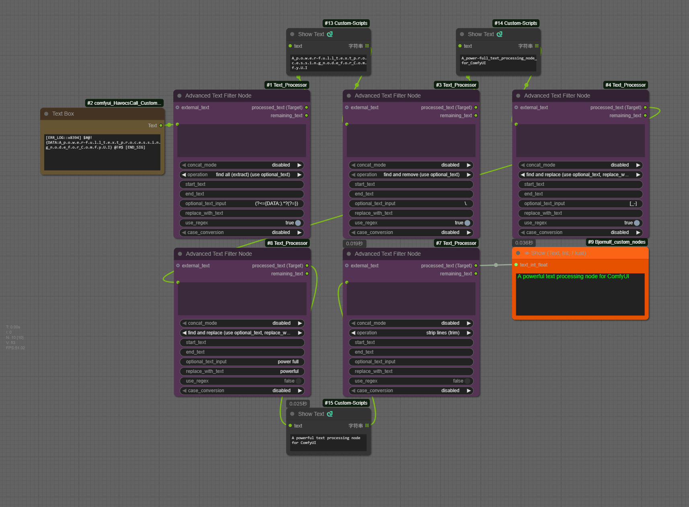

[](./README.md)

# ComfyUI Text Processor (文字處理工具包)



這是一套專為 ComfyUI 設計的全方位工具節點合集，涵蓋文字處理、邏輯運算與圖像工具。旨在增強提示詞工程、文字操作和自動化工作流的效率。

## 1. Advanced Text Filter Node (核心節點)

這是一個功能強大且高度靈活的文字處理節點，專為 ComfyUI 設計，旨在自動化和簡化您的動態提示詞（Dynamic Prompts）工作流。

無論您是需要從一大段文本中精確提取特定部分、批量替換關鍵字，還是清理雜亂的文字，這個節點都能提供強大的支援。其**雙重輸出設計**允許您建立複雜的**節點串聯（Chaining）**，將一個節點的剩餘文本傳遞給下一個節點進行進一步處理。

### 核心特色

* **雙重輸出（節點串聯）**：提供 `processed_text (Target)` 和 `remaining_text` 兩個輸出。您可以將 `remaining_text` 連接到另一個 `AdvancedTextFilter` 節點，實現多步驟的文本解析。
* **13+ 種操作模式**：
    * 全局查找/替換 (`Find/Replace/Extract`)
    * 首次匹配分割 (`Split/Between`)
    * 格式清理 (`Cleanup`)
* **強大的 Regex 支援**：`use_regex` 開關可將所有查找和分割操作切換為使用正規表示式，實現複雜的模式匹配。
* **多關鍵字處理**：`Find/Replace` 操作支援在 `optional_text_input` 欄位中使用逗號 (`,`) 分隔多個查找目標。
* **輸入靈活性**：可選的 `external_text` 輸入，允許您在處理前將兩段文本（如 B-box 數據和提示詞）進行合併。
* **預處理**：內建 `to UPPERCASE` / `to lowercase` 功能，在執行任何操作前統一大小寫。

### 操作模式

#### A. Find / Replace / Extract (全局操作)
這組操作會查找並處理**所有**匹配的實例。
* **`find and remove`**: 移除指定關鍵字。
* **`find and replace`**: 將關鍵字替換為指定內容。
* **`find all (extract)`**: 提取所有匹配項；剩餘文本為移除了匹配項的內容。

#### B. Split & Between (首次匹配)
這組操作只會針對**第一個**匹配的實例進行操作。
* **`extract between`** / **`remove between`** (提取/移除兩段文字中間的內容)
* **`extract before start text`** / **`remove after start text`**
* **`extract after start text`** / **`remove before start text`**

#### C. Text Cleanup (文本清理)
* `remove empty lines`, `remove newlines`, `strip lines`, `remove all whitespace`.

---

## 2. 文字工具節點 (Text Utilities)

### 📝 Text Input Node (文字輸入)
智慧型文字合併工具，最多可支援 7 組輸入。
* **混合輸入：** 包含 3 個連接點（Slots）和 4 個文字框（Widgets）。
* **自動清理：** 自動過濾空字串，避免出現多餘的分隔符號。
* **趣味防呆：** 若未輸入任何內容，會回傳一組可愛的預設提示詞。

### 📰 Text Scraper Node (網頁爬蟲)
從指定網址抓取標題並格式化，適合用於為 LLM 提供即時上下文。
* **簡單易用：** 僅需輸入 URL 字串。
* **智慧解析：** 自動識別網頁標題 (`h1`-`h4`) 與類別。
* **安全機制：** 內建超時與錯誤處理，防止工作流卡死。

### 💾 Text Storage Node (文字倉庫)
ComfyUI 內部的「持久化剪貼簿」，可直接在介面上管理常用文本。
* **四種模式：** 儲存 (`Save`)、讀取 (`Load`)、移除 (`Remove`)、替換 (`Replace`)。
* **本地儲存：** 數據保存在節點目錄下的 `text_storage.json`，備份方便。
* **即時更新：** 儲存新文本後，下拉選單會自動刷新。

### 🃏 Wildcards Node (外掛卡工具)
支援 `__tag__` 語法與 `{A|B}` 隨機選擇語法，用於生成動態提示詞。
* **雙版本：**
    * **Basic:** 簡潔的純文字框版本。
    * **Advanced:** 增加下拉選單，可直接選擇 `wildcards` 資料夾內的檔案。
* **跨平台：** 完美支援 Windows 與 Linux/macOS 路徑。
* **獨立亂數：** 每個輸入欄位擁有獨立的亂數種子，確保多樣性。

---

## 3. 邏輯與數學節點 (Logic & Math)

基於 `simpleeval` 安全地評估 Python 表達式，用於動態計算與邏輯控制。

### 🧮 Simple Eval (整數 / 浮點數 / 字串)
無需編寫複雜代碼即可執行數學運算或字串操作。
* **三種變體：** 提供 `Integers` (整數)、`Floats` (浮點數) 和 `Strings` (字串) 專用節點。
* **變數支援：** 支援 `a`、`b`、`c` 三個輸入變數。可在表達式中直接使用（例如：`(a + b) * 2` 或 `a + " " + b`）。
* **安全執行：** 受限的執行環境防止不安全的代碼運行，同時保留強大的邏輯功能。
* **控制台日誌：** 可選的開關，用於將結果列印到控制台以便除錯。

---

## 4. 圖像工具節點 (Image Utilities)

### ✂️ Image Cropper (圖片裁切)
一個方便的實用工具，可直接在工作流中裁切圖片。
* **精準裁切：** 輕鬆去除不需要的邊緣或聚焦於特定主體。
* **批量處理：** 支援對批量圖片 (Image Batches) 進行裁切。

### 🖼️ Add Text to Image (圖片加字)
在圖片上繪製文字，支援高級排版功能。
* **自動縮放：** 文字大小會根據圖片寬度自動調整。
* **背景色塊：** 支援半透明背景顏色與邊距設定。
* **批量支援：** 支援批量圖片處理 (Batch Processing)。
* **格式兼容：** 強制輸出標準 RGB 圖像，確保與 Video/VAE 節點的兼容性。

---

## 安裝說明

### 方法 1：透過 ComfyUI Manager (推薦)

這是最簡單的安裝方式。

1.  在 ComfyUI 介面中打開 **ComfyUI Manager**。
2.  點擊 **"Custom Nodes Manager"**。
3.  搜尋 `ComfyUI Text Processor`。
4.  點擊 **Install** (安裝) 並等待完成。
5.  **重新啟動 ComfyUI**。

### 方法 2：手動安裝 (Manual)

如果您習慣使用終端機指令：

1.  進入您的 ComfyUI 自定義節點目錄：
    ```bash
    cd ComfyUI/custom_nodes/
    ```
2.  克隆此倉庫：
    ```bash
    git clone https://github.com/rookiestar28/ComfyUI_Text_Processor.git
    ```
3.  **安裝依賴庫：**
    ```bash
    pip install -r requirements.txt
    ```
4.  **重新啟動 ComfyUI**。

---

### 📂 資源設置 (建議)

* **字型檔：** 請將 `.ttf` 或 `.otf` 檔案放入 `ComfyUI/custom_nodes/ComfyUI_Text_Processor/fonts/` 資料夾中（用於圖片加字節點）。
* **Wildcards (外掛卡)：** 將您的外掛卡文字檔放入 `ComfyUI/wildcards/` 或插件目錄下的 `wildcards/` 中。

<details>
<summary><strong>點擊查看常用 Regex 範例 (Regex 速查表)</strong></summary>

### 🧹 基礎清理 (Basic Cleaning)

| 目標功能 | Regex Pattern | 功能說明 |
| :--- | :--- | :--- |
| **清除多餘空白** | `\s+` | 將連續的多個空格縮減為單一空格。 |
| **僅保留英文與符號** | `[^a-zA-Z0-9,\.\s]` | 清除中文或特殊字元，只保留英文、數字、逗號與句點。 |
| **移除所有數字** | `\d+` | 移除字串中的所有數字 (例如權重數值或種子碼)。 |
| **清除換行符號** | `[\r\n]+` | 將換行符號替換為逗號 (適合將列表轉為單行 Prompt)。 |

### 🔍 進階提取與過濾 (Advanced)

| 目標功能 | Regex Pattern | 功能說明 |
| :--- | :--- | :--- |
| **移除 HTML 標籤** | `<[^>]*>` | 清除網頁抓取資料中的 HTML 代碼 (如 div, br 等)。 |
| **移除權重語法** | `\(([^)]*:\d+(?:\.\d+)?)\)` | 移除 ComfyUI 標準權重寫法，如 `(text:1.2)`。 |
| **提取 Email** | `[a-zA-Z0-9._%+-]+@[a-zA-Z0-9.-]+\.[a-zA-Z]{2,}` | 從雜亂文本中精準抓取 Email 地址。 |
| **匹配萬用字元** | `__\w+__` | 匹配常見的 Wildcard 語法，如 `__tag__`。 |

</details>