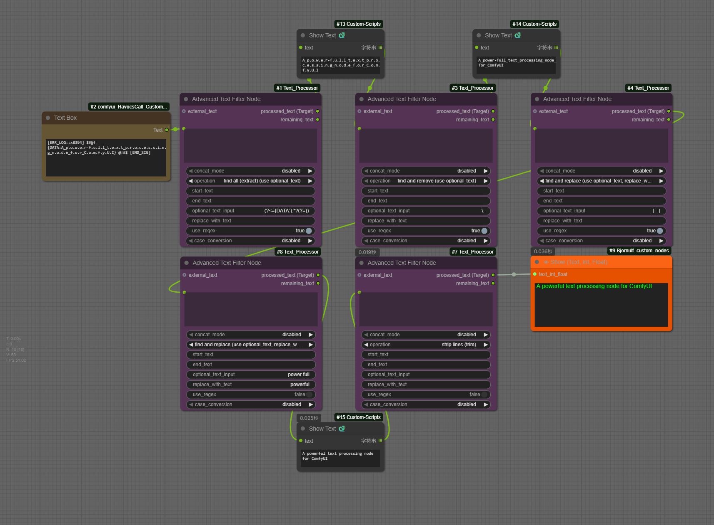

[](./README.md)

# ComfyUI Text Processor (文字處理工具包)



---

**01/2026 更新：** 在 add_text_to_image 節點新增智慧文字自適應功能 `auto_adapt` 開關 - 自動換行過長文字並調整字體大小以符合圖片尺寸，另提供截斷模式搭配省略號以固定字體渲染。現已同步強制高度與寬度檢查。

## 相容性與宿主支援

* **發行需求：** ComfyUI Text Processor 1.6.0 需要 Python 3.10+ 與 ComfyUI Core 0.22.3+。
* **已驗證的 Desktop 下限：** 相容性契約涵蓋的最舊宿主組合為 Desktop 0.9.4、Core 0.22.3 與 Frontend 1.43.18。
* **目前宿主觀測：** 本節點套件也已對照 Core 0.29.0 與 Frontend 1.49.1；這是目前的相容性快照，不代表新的最低或最高支援版本。
* **Node API 方針：** 正式節點維持 V1 以確保相容性；在 ComfyUI 發布比實驗性 `v0_0_2` 契約更新且穩定的 node API 前，會暫緩 V3 遷移。
* **介面內說明：** 全部 145 個可見節點輸入都有宿主 tooltip，另有 9 個複雜節點在 ComfyUI node-help 介面提供備援 Markdown 說明。

專為 ComfyUI 打造的進階自動化工具套件，連結原始數據與生成式 AI。具備批量文字清洗（針對圖生文工作流）、LLM 輸出解析、動態通配符以及邏輯運算功能，旨在簡化複雜的提示工程工作流。

---

## 1. Advanced Text Filter Node (核心節點)

這是一個功能強大且高度靈活的文字處理節點，專為 ComfyUI 設計，旨在自動化和簡化您的動態提示詞（Dynamic Prompts）工作流。

無論您是需要從一大段文本中精確提取特定部分、批量替換關鍵字，還是清理雜亂的文字，這個節點都能提供強大的支援。其**雙重輸出設計**允許您建立複雜的**節點串聯（Chaining）**，將一個節點的剩餘文本傳遞給下一個節點進行進一步處理。

### 核心特色

* **雙重輸出（節點串聯）**：提供 `processed_text (Target)` 和 `remaining_text` 兩個輸出。您可以將 `remaining_text` 連接到另一個 `AdvancedTextFilter` 節點，實現多步驟的文本解析。
* **17+ 種操作模式**：
  * 全局查找/替換 (`Find/Replace/Extract`)
  * 首次匹配分割 (`Split/Between`)
  * 格式清理 (`Cleanup`)
  * [New] LLM 輸出解析 (JSON, 程式碼區塊)
* **強大的錯誤處理 (v1.1.5)**：新增 `if_not_found` 選項，允許您設定當找不到匹配項時的行為（返回原文本、返回空字串或報錯），有效防止批次工作流中斷。
* **強大的 Regex 支援**：`use_regex` 開關可將所有查找和分割操作切換為使用正規表示式，實現複雜的模式匹配。**現已支援 `DOTALL` 模式**（可跨行匹配）。
  * Regex 擷取時，單一 capture group 會直接輸出該群組文字；多個 capture groups 會以 `group1 | group2` 形式組合。
* **多關鍵字處理**：`Find/Replace` 操作支援在 `optional_text_input` 欄位中使用逗號 (`,`) 分隔多個查找目標。
* **輸入靈活性**：可選的 `external_text` 輸入，允許您在處理前將兩段文本（如 B-box 數據和提示詞）進行合併。
* **預處理**：內建 `to UPPERCASE` / `to lowercase` 功能，在執行任何操作前統一大小寫。

### 操作模式

#### A. Find / Replace / Extract (全局操作)

這組操作會查找並處理**所有**匹配的實例。

* **`find and remove`**: 移除指定關鍵字。
* **`find and replace`**: 將關鍵字替換為指定內容。
* **`find all (extract)`**: 提取所有匹配項；剩餘文本為移除了匹配項的內容。

#### B. Split & Between (首次匹配)

這組操作只會針對**第一個**匹配的實例進行操作。

* **`extract between`** / **`remove between`** (提取/移除兩段文字中間的內容)
* **`extract before start text`** / **`remove after start text`**
* **`extract after start text`** / **`remove before start text`**

#### C. Text Cleanup (文本清理)

* `remove empty lines`, `remove newlines`, `strip lines`, `remove all whitespace`.

#### D. LLM 工具箱 (v1.1.5 新增)

專為處理大型語言模型 (LLM) 原始輸出而設計的工具。

* **`LLM: extract code block (```)`**：精確提取位於三個反引號之間的程式碼內容。
* **`LLM: extract JSON object ({...})`**：定位並提取第一個有效的 JSON 物件結構，便於後續連接 JSON 解析器。
* **`LLM: clean markdown formatting`**：移除粗體 (`**`)、斜體 (`*`)、標題 (`#`) 和連結語法，還原純淨文本。

#### E. 批量操作 (Batch Operations) (v1.2.0 新增)

專為圖生文 (Img2Text) 工作流或大量清洗需求設計。

* **`batch replace (use replacement_rules)`**：在一次執行中完成多組「查找與替換」操作。
  * 使用 `replacement_rules` 輸入框。
  * **語法：** `查找內容 -> 替換內容` (每一行一條規則)。
  * 範例：

      ```text
      ugly -> beautiful
      bad hands -> detailed hands
      error_tag -> 
      ```

      (箭頭右側留空即代表刪除該詞)
  * 若啟用 `use_regex`，查找內容可支援正規表示式。

---

## 2. 文字工具節點 (Text Utilities)

### Text Input Node (文字輸入)

智慧型文字合併工具，最多可支援 7 組輸入。

* **混合輸入：** 包含 3 個連接點（Slots）和 4 個文字框（Widgets）。
* **自動清理：** 自動過濾空字串，避免出現多餘的分隔符號。
* **趣味防呆：** 若未輸入任何內容，會回傳一組可愛的預設提示詞。

### Text Scraper Node (網頁爬蟲)

從公開的 HTTP/HTTPS 網址抓取標題並格式化，適合用於為 LLM 提供即時上下文。

* **簡單易用：** 僅需輸入 URL 字串。
* **智慧解析：** 會從 `h1`-`h3`、headline 類型的 class 名稱與對應連結中尋找標題。
* **安全機制：** 預設只允許 HTTP/HTTPS 公開目標，阻擋本機/私有網路位址，並內建超時避免工作流卡死。

### Text Storage Nodes (文字倉庫 - 讀寫分離版)

ComfyUI 內部的「持久化剪貼簿」。允許您在不同的工作流或會話之間保存與讀取文字數據；目前版本在可用時會把新資料寫入 ComfyUI user directory，並保留對節點目錄下舊版 `text_storage/` 資料的讀取相容性。

#### **Text Storage (Writer / 寫入器)**

將文字內容保存到檔案或內部資料庫。

* **Inputs (輸入):**
  * `text_input`: 要保存的文字內容。
  * `filename_prefix`: 可選的分類前綴 (例如 `ProjectA_`)。
  * `save_name`: 主要檔名或鍵值。支援 **時間格式化** (如 `%Y-%m-%d`) 與 **通配符** (如 `***` 代表自動編號 001, 002...)。
  * `mode`:
    * **Add New (Auto Rename)**: 新增模式。若檔名重複會自動更名 (例如 `Log_2024-11-26_001.txt`)，避免覆蓋。
    * **Overwrite Existing**: 覆蓋模式。若檔名存在則直接覆蓋內容。
    * **Delete**: 刪除模式。若新舊儲存位置都存在同名資料，會同時移除目前 user directory storage 與舊版 plugin-local storage 中的指定檔案或鍵值。
  * **`storage_format` (新功能!)**:
    * `json`: 作為鍵值對 (Key-Value) 儲存在內部的 `text_storage.json` 資料庫中。
    * `txt`: 儲存為獨立的 `.txt` 文字檔，方便外部編輯或查看。

#### **Text Storage (Reader / 讀取器)**

讀取已保存的文字內容。

* **統一列表:** 自動掃描並列出資料夾內所有的 JSON 鍵值與 `.txt` 檔案。
* **直通輸出:** 輸出選定的文字內容字串。
* **> 重要提示:** 下拉選單是在節點載入時生成的。如果您剛剛透過 Writer 寫入了新檔案，必須 **重新整理 ComfyUI 網頁 (F5)**，新檔案才會出現在 Reader 的列表中。

#### Text Storage 與 Core SaveText

較新的 ComfyUI Core 提供 `SaveText`，適合把文字直接輸出為帶編號的 `.txt`、`.md` 或 `.json` 檔案至 ComfyUI output 目錄，並將送入的文字直通輸出。若工作流需要跨會話共用的具名持久資料、獨立 Reader、JSON/TXT 儲存、add 自動更名、overwrite、delete，以及舊版資料回退讀取，則 Text Storage 更合適。`SaveText` 在已驗證的 Desktop 下限之後才加入，因此較舊但仍受支援的宿主可能沒有此節點。

### Wildcards Processor (動態提示詞混合器)

使用通配符語法（如 `__style__`）和隨機選擇（如 `{cat|dog}`）生成豐富的動態提示詞。此節點已進化為強大的 **7 槽混合器**。

* **單一整合版 (7-Slot Mixer)**：
    不再區分基礎/進階版。現在是一個功能強大的單一節點，提供 **7 組輸入插槽**，允許您以分層方式組合手動輸入與通配符檔案。
* **混合輸入機制**：
    每一組插槽都包含一個 **文字框**（用於手動輸入或 `{選項}` 語法）和一個 **下拉選單**（用於選擇 Wildcard 檔案）。兩者可同時使用，結果會自動串接。
* **智慧 "Random" 模式**：
    下拉選單中包含一個特殊的 **"Random"** 選項。選中後，它會從您的資料夾中隨機抽取一個 Wildcard 檔案使用，增加驚喜感。
* **遞迴生成**：
    完全支援嵌套的通配符（即 Wildcard 檔案內容中還可以包含其他 `__wildcards__`）。
* **獨立種子**：
    每個輸入插槽內部使用獨立的亂數種子偏移。這確保了即使您在多個插槽使用相同的 `{A|B}` 語法，它們也不會產生重複僵化的結果。
* **Wildcard 來源**：
    會先讀取 `ComfyUI/wildcards/`，再讀取此外掛的 `wildcards/`；重名時以 ComfyUI 根目錄的檔案優先。

---

## 3. 邏輯與數學節點 (Logic & Math)

基於 `simpleeval` 安全地評估 Python 表達式，用於動態計算與邏輯控制。

### Simple Eval (整數 / 浮點數 / 字串)

無需編寫複雜代碼即可執行數學運算或字串操作。

* **三種變體：** 提供 `Integers` (整數)、`Floats` (浮點數) 和 `Strings` (字串) 專用節點。
* **變數支援：** 支援 `a`、`b`、`c` 三個輸入變數。可在表達式中直接使用（例如：`(a + b) * 2` 或 `a + " " + b`）。
* **安全執行：** 受限的執行環境防止不安全的代碼運行，同時保留強大的邏輯功能。
* **控制台日誌：** 可選的開關，用於將結果列印到控制台以便除錯。

### Global Random Seed（全域隨機種子）

`Global Random Seed` 是零連線工作流控制器：只要它存在於送出的 prompt，
後端就會把有範圍限制的 seed 指派給可識別的 literal seed 輸入，不需要連接
`applied_seed`。若其他節點需要明確取得本次套用的基準 seed，仍可使用這個輸出。

#### 位元寬度與相容性

| `seed_width` | 包含端點的範圍 | 使用建議 |
| --- | ---: | --- |
| `uint32`（預設） | `0..4294967295` | 工作流包含僅支援 uint32 的 sampler 或 API 節點時使用。 |
| `uint64` | `0..18446744073709551615` | 僅在所有受影響節點都接受較寬範圍時啟用。 |

位元寬度由使用者選擇；控制器不會執行或推斷任意第三方節點的 schema。因此，
uint32-only 節點仍可能拒絕 `uint64`。`uint32` 代表數值範圍，不是短位數顯示
格式；合法值最多仍可有十位十進位數字。

#### Queue 與目標節點行為

* **`timing`：** `before_generation` 會先執行 queue action，再把結果指派給
  本次 prompt；`after_generation` 會先使用目前值，再推進下一個控制器值。
* **`queue_action`：** `fixed`、`increment`、`decrement` 或 `randomize`
  控制每次送出 prompt 之間如何推進控制器。
* **`distribution`：** `same`、`increment`、`decrement` 或 `randomize`
  依穩定的 node ID 順序分配基準值。`randomize` 會為每個符合條件的目標產生
  各自獨立且不越界的 seed，因此目標值不一定等於 `applied_seed`。
* 只會修改名稱為 `seed`、`noise_seed` 或 `seed_num` 的 literal integer
  輸入；連線、布林值、非整數及其它輸入都保持不變。
* 同一 prompt 有多個控制器時，以 canonical 排序最低的控制器 node ID 為準。

`value` 與 `last_seed` 會以精確的 unsigned decimal 文字回讀。超過 JavaScript
safe-integer 範圍的值在後端仍保持精確，但不會把不安全的 `uint64` 寫入目標
numeric widget，以免顯示經過捨入的錯誤數值。目標節點自身若使用非 `fixed`
的 `control_before_generate`／`control_after_generate`，也可能在 prompt
送出後把畫面 widget 換成下一個 seed；需要直接比對目標 widget 與
`last_seed` 時，請把該目標控制設為 `fixed`。

API prompt 不需要 serialized workflow metadata 也能使用。沒有瀏覽器 client
時，呼叫端必須自行把下一個控制器 `value` 帶入後續請求；伺服器刻意不保存
per-client continuation state。後端作用範圍以送出 prompt 中實際存在且符合
條件的節點為準。root/current graph widget 會盡力回讀，但不保證 nested
subgraph widget 同步；這不影響已送出 prompt 的後端 seed 指派。

完整輸入摘要請參閱 [Global Random Seed 節點說明](./web/docs/Global_RandomSeed.md)。

---

## 4. 圖像工具節點 (Image Utilities)

### Advanced Image Saver (進階圖像儲存器)

專業級圖片輸出節點，具備進階品質控制與美學評分過濾功能。

* **美學評分過濾:**
  * 可選擇使用 **Aesthetic Predictor V2.5** 評分模型；若要啟用請先執行 `pip install aesthetic-predictor-v2-5`。
  * `calculate_aesthetic_score` 會啟用節點內建的逐張圖片評分。
  * 內建評分的模型載入流程需要 trusted remote code，因此 `allow_aesthetic_remote_code` 預設停用，必須明確啟用後才會載入模型。
  * `aesthetic_precision` 支援 `auto`、`bf16`、`fp16`、`fp32` 與 `cpu_fp32`；`auto` 會選用目前支援的最佳 device/precision，並在需要時自動 fallback。
  * `keep_aesthetic_model_loaded` 控制評分器是否在單次執行後保留於快取中。
  * 可選的 `aesthetic_score` 輸入可直接接收外部評分，不需載入內建評分模型。
  * 低於 `aesthetic_threshold` 的圖片會從輸出中濾除。
* **靈活的輸出路徑:**
  * 動態路徑解析，支援時間格式化(如 `[time(%Y-%m-%d)]` → `2025-12-25`)。
  * 相對路徑會限制在 ComfyUI output 目錄內；絕對路徑必須明確啟用 `allow_absolute_output_path`。
  * 資料夾不存在時自動建立。
* **智慧檔名生成:**
  * 可自訂 `filename_prefix`、`filename_delimiter` 與 `filename_number_padding`。
  * 自動遞增計數器，並偵測檔名衝突。
  * `filename_number_start` 可切換數字在前或在後格式(`0001_前綴` 或 `前綴_0001`)。
  * `overwrite_mode = prefix_as_filename` 會直接使用前綴作為靜態檔名。
* **多格式支援:**
  * **PNG**: 透過 PngInfo 儲存節點控制的 metadata。
  * **JPEG/JPG**: 品質控制(1-100)，支援 DPI 設定。
  * **WebP**: 支援無損模式，並以 EXIF 儲存 metadata。
  * **BMP/TIFF**: 額外的備用格式選擇。
* **中繼資料管理:**
  * `metadata_mode` 支援 `full / minimal / none`。
  * `embed_workflow` 控制是否寫入可讓 ComfyUI 復原工作流的 `prompt` / `workflow` graph。
  * 停用工作流嵌入時，輸出 metadata 不會包含可讓 ComfyUI 復原原始工作流的 `prompt` 或 `workflow` graph。
  * `minimal` 模式會保留目前的 `parameters` 摘要，供下游 metadata 讀取使用。
  * JPEG/JPG 的 metadata 支援刻意維持有限；需要回讀 metadata 時請使用 PNG 或 WebP。
  * WebP 格式:將資料儲存於 EXIF 標籤(Make/ImageDescription)。
* **輸出控制:**
  * **三組輸出**: `filtered_images` (IMAGE)、`files` (檔案路徑列表)、`scores` (美學分數列表)。
  * 可選的預覽開關，適用於無頭工作流。若儲存到 ComfyUI output 以外的絕對路徑，檔案仍會從 `files` 回傳，但不產生 ComfyUI 預覽，因為 `/view` 只會服務宿主管理的 output 路徑。
  * 僅回傳通過美學閾值的圖片給下游節點。

### Image Cropper (圖片裁切)

一個方便的實用工具，可直接在工作流中裁切圖片。

* **精準裁切：** 可依固定邊長、長寬比、對齊方式與 XY 偏移量進行裁切。
* **Mask 導引：** 可選擇使用 `MASK` 來偏移裁切中心，使主體更容易置中。
* **可選縮放：** 裁切後可再依最長邊、最短邊、寬或高做縮放。
* **批量處理：** 支援對批量圖片 (Image Batches) 進行裁切。

### Resize Image Advanced (進階圖片縮放)

以直接尺寸、等比例自動換算與可選遮罩對齊來縮放圖片 batch。

* **節點 ID：** 註冊為 `ResizeImageAdvanced`，顯示名稱為 `Resize Image Advanced`。
* **縮放模式：** 可使用明確寬高，或透過 `original`、`custom` 與常見比例預設自動換算目標尺寸。
* **目標邊長：** `scale_to_side` 支援長邊、短邊、寬、高與總像素量（kilo pixel）目標。
* **適配模式：** 支援 `fill`、`stretch`、`resize`、`letterbox`、`pad`、`pad_edge`、`pad_edge_pixel`、`pillarbox_blur`、`crop`、`total_pixels`。
* **縮放方法與裝置：** 保留 KJ 風格的 `nearest-exact`、`bilinear`、`area`、`bicubic`、`lanczos` 與可選 `nvidia_rtx_vsr`，並提供 CPU/GPU 裝置選擇。RTX VSR 需要相容的 NVIDIA VFX runtime 與 GPU。
* **背景填色：** `background_color` 控制 letterbox / pad 的畫布背景色。
* **整數倍數對齊：** `round_to_multiple` 可讓最終尺寸符合指定整數倍，涵蓋原 KJ `divisible_by` 行為。
* **遮罩對齊：** 可選 `MASK` 會隨圖片同步縮放、裁切或補邊，並輸出對齊後的 mask。
* **工作流輔助：** 輸出 `IMAGE`、最終 `width`、最終 `height` 與對齊後的 `MASK`，方便串接後續節點。

### Image and Mask IO (圖片與遮罩輸入輸出)

提供圖片與遮罩輸入輸出的工具節點，便於載入批次圖片或在工作流中重複使用 mask。

* **Load Image Batch：** 依 `path` 與相對 `pattern` 從資料夾載入一張靜態 `IMAGE`，支援固定索引、逐張遞增與可重現隨機選取。若 ComfyUI 支援 validation hook，無效資料夾、空匹配、不安全 pattern、超出範圍的固定索引會在執行前回報。註冊 ID 為 `LoadImageBatch`。
* **Save Mask：** 將 `MASK` 以 PNG 形式寫入 ComfyUI output 目錄、回報至 ComfyUI 預覽介面，並將原始 `MASK` 不變地回傳以便串接下游節點。
* **Load Mask：** 從 ComfyUI input 目錄載入支援的圖片檔並轉成 `MASK`。
* **ComfyUI 整合：** 優先使用 ComfyUI 的 input/output 路徑輔助函式。

### Image Concat Advanced (多圖拼接)

將一個 batch（或 list）的多張圖片拼接成可指定方向的網格圖。

* **方向：** `left_to_right / right_to_left / top_to_bottom / bottom_to_top`。
* **換行限制：** `max_images_per_line` 控制超過幾張後換到下一列或下一欄。
* **縮放：** 每個格子使用第一張圖片尺寸；其他圖片會保留長寬比自動縮放置中。
* **空缺補齊：** 最後一列或欄不足時會自動補空白格。
* **輸出通道：** 可強制 `rgb`（預設）、`rgba` 或 `auto`。

### Add Text to Image (圖片加字)

在圖片上繪製文字，支援高級排版功能。

* **自適應排版：** `auto_adapt` 會自動換行並縮小字體以同時符合寬與高；停用時則改用固定字級加省略號截斷。
* **靈活定位：** 支援角落/置中錨點、邊距、`text_box` / `full_width_strip` 背景模式與行距。
* **批量支援：** 支援批量圖片處理 (Batch Processing)。
* **字型回退：** 若工作流中的字型名稱在當前環境不存在，會盡量尋找可相容的替代字型。
* **格式兼容：** 強制輸出標準 RGB 圖像，確保與下游 image/video 節點相容。

#### Add Text to Image 與 Core TextOverlay

較新的 ComfyUI Core 提供 `TextOverlay`，適合以預設字型將相同文字套用到整個 batch，並控制相對圖片高度的字級、上／下位置、水平對齊、顏色與可選黑色外框。Add Text to Image 則適合需要自選字型、逐張圖片標籤、7 個錨點位置、像素級邊距與行距、RGBA 文字框或橫條背景，以及自適應換行／縮字或省略號截斷的工作流。`TextOverlay` 在已驗證的 Desktop 下限之後才加入，因此較舊但仍受支援的宿主可能沒有此節點。

---

## 安裝說明

### 方法 1：透過 ComfyUI Manager (推薦)

這是最簡單的安裝方式。

1. 在 ComfyUI 介面中打開 **ComfyUI Manager**。
2. 點擊 **"Custom Nodes Manager"**。
3. 搜尋 `ComfyUI Text Processor`。
4. 點擊 **Install** (安裝) 並等待完成。
5. **重新啟動 ComfyUI**。

### 方法 2：手動安裝 (Manual)

如果您習慣使用終端機指令：

1. 進入您的 ComfyUI 自定義節點目錄：

    ```bash
    cd ComfyUI/custom_nodes/
    ```

2. 克隆此倉庫：

    ```bash
    git clone https://github.com/rookiestar28/ComfyUI_Text_Processor.git
    ```

3. **安裝依賴庫：**

    ```bash
    pip install -r requirements.txt
    ```

    可選的內建美學評分支援：

    ```bash
    pip install aesthetic-predictor-v2-5
    ```

4. **重新啟動 ComfyUI**。

---

### 資源設置 (建議)

* **字型檔：** 請將 `.ttf` 或 `.otf` 檔案放入 `ComfyUI/custom_nodes/ComfyUI_Text_Processor/fonts/` 資料夾中（用於圖片加字節點）。
* **Wildcards (外掛卡)：** 將您的外掛卡文字檔放入 `ComfyUI/wildcards/` 或插件目錄下的 `wildcards/` 中。

---

## 授權

本專案採用 MIT License。詳細內容請見 `LICENSE`。

<details>
<summary><strong>點擊查看常用 Regex 範例 (Regex 速查表)</strong></summary>

### 基礎清理 (Basic Cleaning)

| 目標功能 | Regex Pattern | 功能說明 |
| :--- | :--- | :--- |
| **清除多餘空白** | `\s+` | 將連續的多個空格縮減為單一空格。 |
| **僅保留英文與符號** | `[^a-zA-Z0-9,\.\s]` | 清除中文或特殊字元，只保留英文、數字、逗號與句點。 |
| **移除所有數字** | `\d+` | 移除字串中的所有數字 (例如權重數值或種子碼)。 |
| **清除換行符號** | `[\r\n]+` | 將換行符號替換為逗號 (適合將列表轉為單行 Prompt)。 |

### 進階提取與過濾 (Advanced)

| 目標功能 | Regex Pattern | 功能說明 |
| :--- | :--- | :--- |
| **移除 HTML 標籤** | `<[^>]*>` | 清除網頁抓取資料中的 HTML 代碼 (如 div, br 等)。 |
| **移除權重語法** | `\(([^)]*:\d+(?:\.\d+)?)\)` | 移除 ComfyUI 標準權重寫法，如 `(text:1.2)`。 |
| **提取 Email** | `[a-zA-Z0-9._%+-]+@[a-zA-Z0-9.-]+\.[a-zA-Z]{2,}` | 從雜亂文本中精準抓取 Email 地址。 |
| **匹配萬用字元** | `__\w+__` | 匹配常見的 Wildcard 語法，如 `__tag__`。 |

</details>
